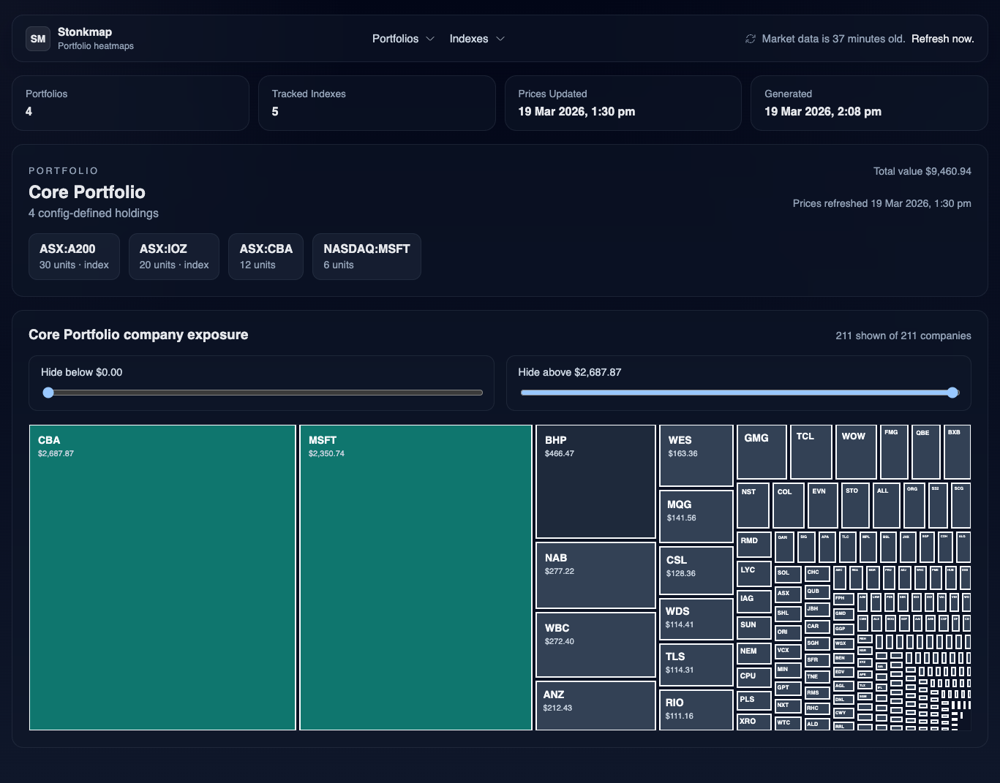

# Stonkmap

Stonkmap is a self-hosted app for visualising the actual company exposure inside config-defined portfolios.

Proudly vibe-coded. Use your own LLM to tweak it to your taste.

## Screenshot

## Docker Compose

`docker compose up --build`

This serves:

- Backend API at `http://localhost:18000`
- Frontend at `http://localhost:15173`

The compose setup now runs in development mode:
- backend runs `uvicorn --reload`
- frontend runs the Vite dev server with file watching
- source directories are bind-mounted, so code, `config.yaml`, and `indexes.yaml` changes restart automatically

The compose setup uses the tracked `config.yaml`, `indexes.yaml`, and sample portfolio CSV files by default.
The local `user-data/` folder is bind-mounted into both containers at `/app/user-data` so local CSV inputs are available without being baked into the images.

## Local Run

**Local run is for masochists, `docker compose` is much simpler**

1. Create a Python environment and install the backend:
   `python3 -m venv .venv && .venv/bin/pip install -e '.[dev]'`
2. Install the frontend:
   `cd frontend && npm install`
3. Edit `config.yaml` and `indexes.yaml` if you want to customise the sample setup.
   Put local-only CSVs and other inputs in `user-data/` and reference them from `config.yaml` with paths like `./user-data/my-portfolio.csv`.
   Portfolio CSV headers must be `exchange,ticker,units,is_index`. Set `is_index=true` for ETFs/index products that should be decomposed via `indexes.yaml`.
4. Run the backend:
   `STONKMAP_CONFIG=config.yaml STONKMAP_INDEXES_PATH=indexes.yaml .venv/bin/stonkmap-api`
5. Run the frontend:
   `cd frontend && VITE_API_BASE_URL=http://localhost:18000/api npm run dev`

## Tests

- Backend: `.venv/bin/pytest`
- Frontend: `cd frontend && npm test`
